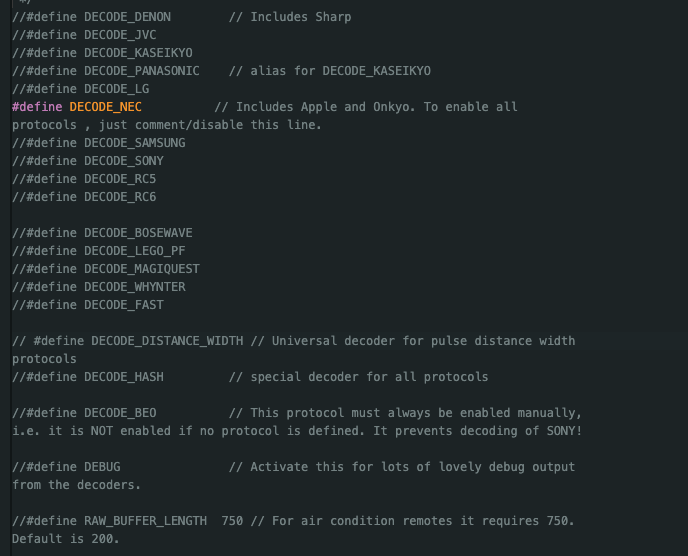
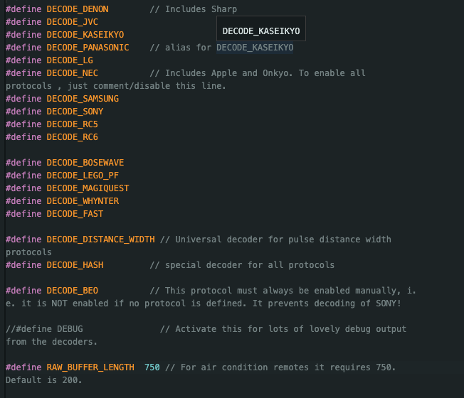
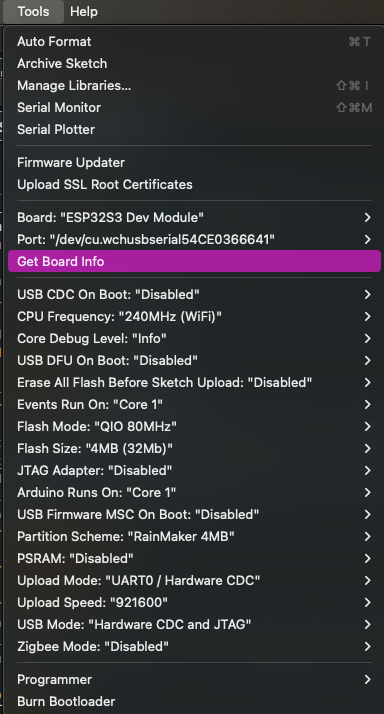
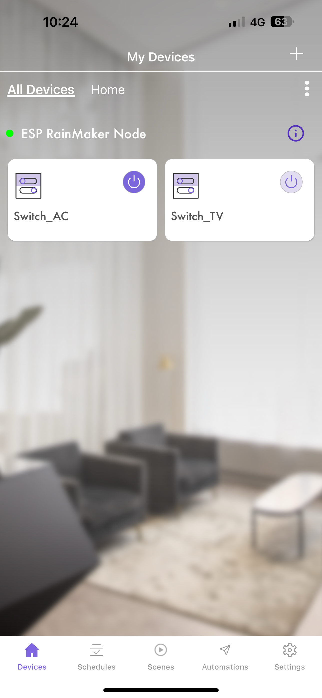
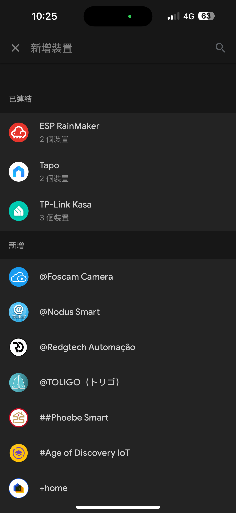
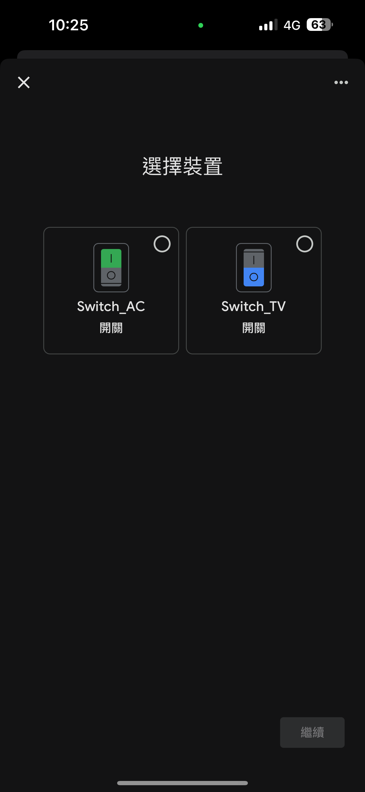
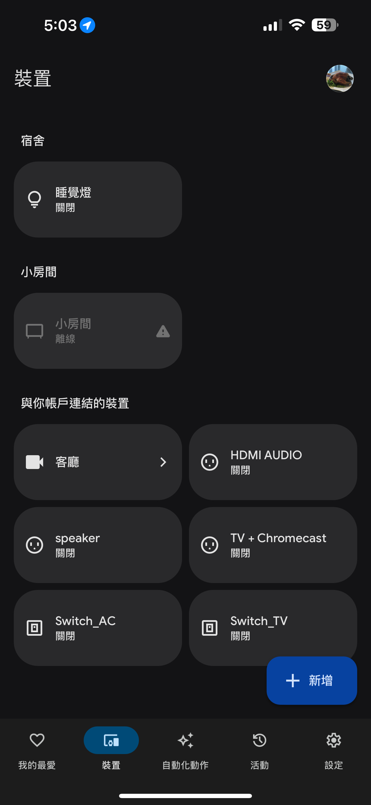

# AC_TV_switch_rainmaker

Board : ESP32-S3
using rainmaker to control the AC and TV power, make original device can remote control

## IR Remote

- install library
    - IRremote
- setup sensor
    - ir led
    - ir receiver
    - npn transistor
- using example code uncomment define and read your remotor

    - it will print the code that add in your ir_send




:::danger
:warning: 
these two function just set pin number
- IrReceiver.begin(irReceiverPin);
- IrSender.begin(irSendPin);
:::


``` cpp=
Protocol=NEC Address=0xAC03 Command=0x5F Raw-Data=0xA05FAC03 32 bits LSB first
Send with: IrSender.sendNEC(0xAC03, 0x5F, <numberOfRepeats>);

Protocol=PulseDistance Raw-Data=0x1200000000 104 bits LSB first
Send on a 32 bit platform with: 
    uint64_t tRawData[]={0x29160F8AB2754D, 0x1200000000};
    IrSender.sendPulseDistanceWidthFromArray(38, 3400, 3450, 350, 1300, 350, 450, &tRawData[0], 104, PROTOCOL_IS_LSB_FIRST, <RepeatPeriodMillis>, <numberOfRepeats>);

Protocol=PulseDistance Raw-Data=0x1000000000 104 bits LSB first
Send on a 32 bit platform with: 
    uint64_t tRawData[]={0x27160F8AB2754D, 0x1000000000};
    IrSender.sendPulseDistanceWidthFromArray(38, 3400, 3450, 400, 1300, 400, 450, &tRawData[0], 104, PROTOCOL_IS_LSB_FIRST, <RepeatPeriodMillis>, <numberOfRepeats>);
```
- design the matter to control your intellengence device on google home or others
    - https://blog.espressif.com/esp-rainmaker-now-in-arduino-cf1474526172



## result

- the result on esp rainmaker app screen



- connect google home and esp rainmaker



- choose device to add into google home



- final result, using google home control the ir sender to turn TV/AC on is working

